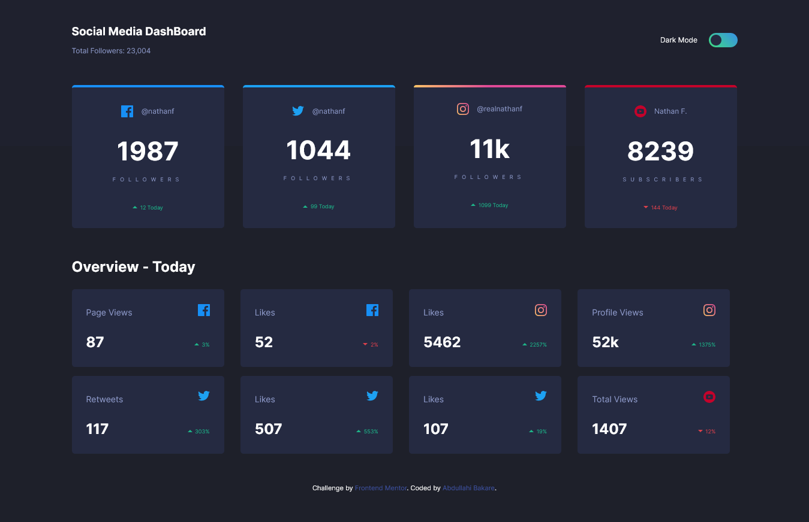

# Frontend Mentor - Social media dashboard with theme switcher solution

This is a solution to the [Social media dashboard with theme switcher challenge on Frontend Mentor](https://www.frontendmentor.io/challenges/social-media-dashboard-with-theme-switcher-6oY8ozp_H). Frontend Mentor challenges help you improve your coding skills by building realistic projects.

## Table of contents

- [Overview](#overview)
  - [The challenge](#the-challenge)
  - [Screenshot](#screenshot)
  - [Links](#links)
- [My process](#my-process)
  - [Built with](#built-with)
  - [What I learned](#what-i-learned)
  - [Useful resources](#useful-resources)
- [Author](#author)
- [Acknowledgments](#acknowledgments)

## Overview

### The challenge

Users should be able to:

- View the optimal layout for the site depending on their device's screen size
- See hover states for all interactive elements on the page
- Toggle color theme to their preference

### Screenshot

### Links

- Solution URL: [Add solution URL here](https://your-solution-url.com)
- Live Site URL: [Add live site URL here](https://your-live-site-url.com)

## My process

I used gulp to compile my SASS to CSS, as such I had to set up my gulp.js and then create components for my styles. I went top-down approach with the build, and saved functionality(JS) for last.

### Built with

- Semantic HTML5 markup
- CSS custom properties
- Flexbox

- CSS Grid
- SASS
- Gulp.js(for compiling Sass among other things)
- Mobile-first workflow

### What I learned

I learnt a few more about the usage of lacal storage, I used it to store preferences for the themes.
I also learnt about arial- label attributes for html tags.
I also learnt about the sibiling selector in CSS.

### Useful resources

- [https://css-tricks.com/snippets/css/a-guide-to-flexbox/] - This is my goto for solutions to any confusion with flexbox.
- [https://css-tricks.com/snippets/css/complete-guide-grid/] - for css grids.
- [https://developer.mozilla.org/en-US/]

## Author

- Website - [https://b86c1b9a.social-media-dashboard-qvl.pages.dev/]
- Frontend Mentor - [@plainsight16]

## Acknowledgments

I want to give special thanks to jessica chan.
